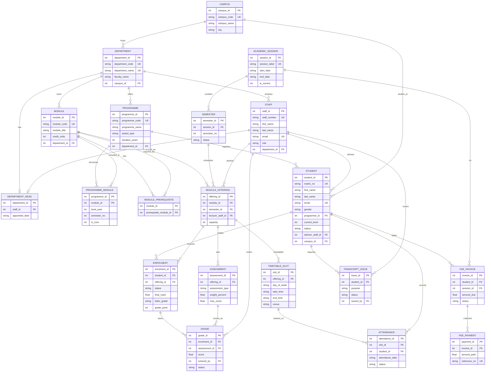

```mermaid
erDiagram
    CAMPUS ||--o{ DEPARTMENT : hosts
    DEPARTMENT ||--o{ STAFF : employs
    DEPARTMENT ||--o| DEPARTMENT_HEAD : has
    STAFF ||--o| DEPARTMENT_HEAD : appointed_as
    DEPARTMENT ||--o{ PROGRAMME : offers
    DEPARTMENT ||--o{ MODULE : owns
    PROGRAMME ||--o{ PROGRAMME_MODULE : structures
    MODULE ||--o{ PROGRAMME_MODULE : included_in
    MODULE ||--o{ MODULE_PREREQUISITE : has
    MODULE ||--o{ MODULE_PREREQUISITE : required_by
    PROGRAMME ||--o{ STUDENT : registers
    STAFF ||--o{ STUDENT : advises
    CAMPUS ||--o{ STUDENT : studies_at
    ACADEMIC_SESSION ||--o{ SEMESTER : contains
    MODULE ||--o{ MODULE_OFFERING : offered_as
    SEMESTER ||--o{ MODULE_OFFERING : schedules
    STAFF ||--o{ MODULE_OFFERING : teaches
    STUDENT ||--o{ ENROLMENT : makes
    MODULE_OFFERING ||--o{ ENROLMENT : receives
    MODULE_OFFERING ||--o{ ASSESSMENT : sets
    ENROLMENT ||--o{ GRADE : earns
    ASSESSMENT ||--o{ GRADE : scored_as
    STAFF ||--o{ GRADE : enters
    MODULE_OFFERING ||--o{ TIMETABLE_SLOT : timetabled
    TIMETABLE_SLOT ||--o{ ATTENDANCE : marked_on
    STUDENT ||--o{ ATTENDANCE : records
    STUDENT ||--o{ FEE_INVOICE : billed
    ACADEMIC_SESSION ||--o{ FEE_INVOICE : for
    FEE_INVOICE ||--o{ FEE_PAYMENT : collected
    STUDENT ||--o{ TRANSCRIPT_ISSUE : requests
    STAFF ||--o{ TRANSCRIPT_ISSUE : issues

    CAMPUS {
        int campus_id PK
        string campus_code UK
        string campus_name
        string city
    }
    DEPARTMENT {
        int department_id PK
        string department_code UK
        string department_name UK
        string faculty_name
        int campus_id FK
    }
    STAFF {
        int staff_id PK
        string staff_number UK
        string first_name
        string last_name
        string email UK
        string role
        int department_id FK
    }
    DEPARTMENT_HEAD {
        int department_id PK
        int staff_id FK
        string appointed_date
    }
    PROGRAMME {
        int programme_id PK
        string programme_code UK
        string programme_name
        string award_type
        int duration_years
        int department_id FK
    }
    MODULE {
        int module_id PK
        string module_code UK
        string module_title
        int credit_units
        int department_id FK
    }
    PROGRAMME_MODULE {
        int programme_id PK
        int module_id PK
        int level_year
        int semester_no
        int is_core
    }
    MODULE_PREREQUISITE {
        int module_id PK
        int prerequisite_module_id PK
    }
    STUDENT {
        int student_id PK
        string matric_no UK
        string first_name
        string last_name
        string email UK
        string gender
        int programme_id FK
        int current_level
        string status
        int advisor_staff_id FK
        int campus_id FK
    }
    ACADEMIC_SESSION {
        int session_id PK
        string session_label UK
        string start_date
        string end_date
        int is_current
    }
    SEMESTER {
        int semester_id PK
        int session_id FK
        int semester_no
        string status
    }
    MODULE_OFFERING {
        int offering_id PK
        int module_id FK
        int semester_id FK
        int lecturer_staff_id FK
        int capacity
    }
    ENROLMENT {
        int enrolment_id PK
        int student_id FK
        int offering_id FK
        string status
        float final_mark
        string letter_grade
        int grade_point
    }
    ASSESSMENT {
        int assessment_id PK
        int offering_id FK
        string assessment_type
        float weight_percent
        float max_score
    }
    GRADE {
        int grade_id PK
        int enrolment_id FK
        int assessment_id FK
        float score
        int entered_by FK
        string status
    }
    TIMETABLE_SLOT {
        int slot_id PK
        int offering_id FK
        string day_of_week
        string start_time
        string end_time
        string venue
    }
    ATTENDANCE {
        int attendance_id PK
        int slot_id FK
        int student_id FK
        string attendance_date
        string status
    }
    FEE_INVOICE {
        int invoice_id PK
        int student_id FK
        int session_id FK
        float amount_due
        string status
    }
    FEE_PAYMENT {
        int payment_id PK
        int invoice_id FK
        float amount_paid
        string reference_no UK
    }
    TRANSCRIPT_ISSUE {
        int issue_id PK
        int student_id FK
        string purpose
        string status
        int issued_by FK
    }
```
